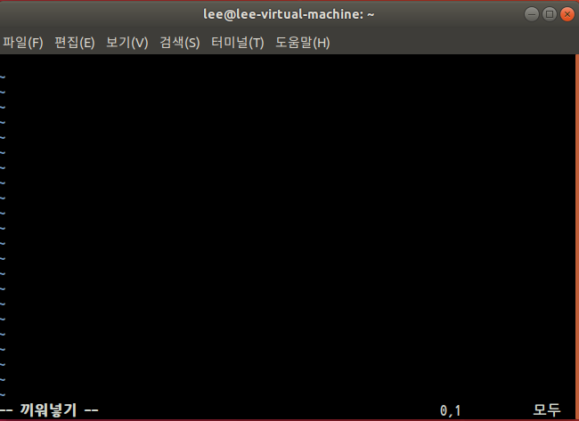
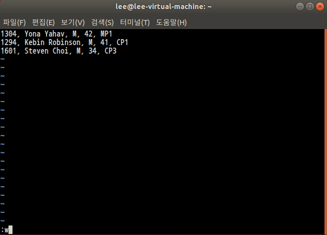
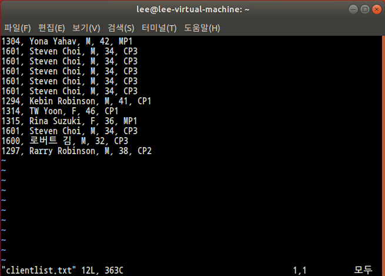
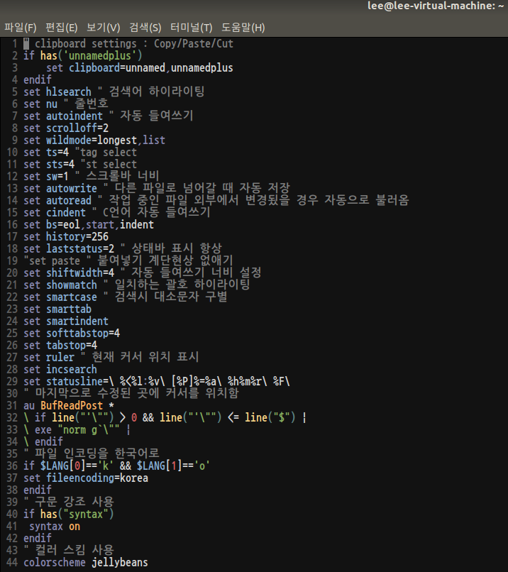
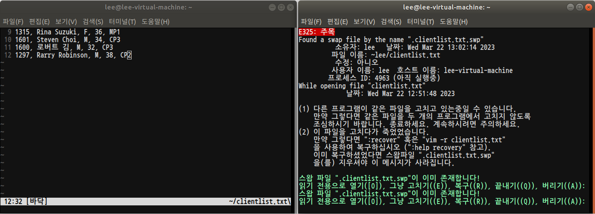
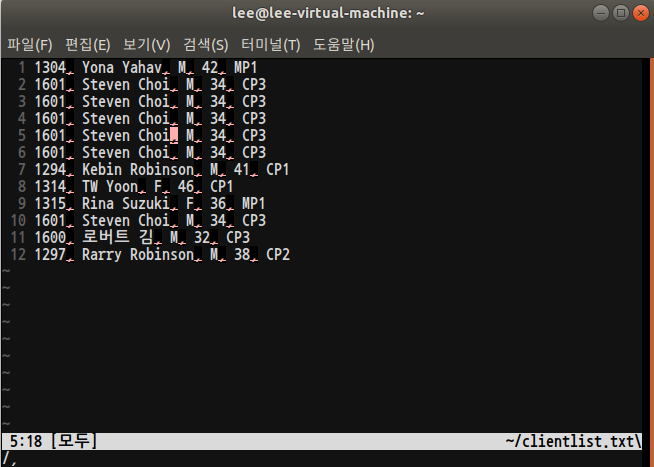

# vim 설치
```
$ sudo apt -y install vim
```
필자는 여기서 약간의 오류가 발생하여 추가적인 명령어를 실행해주었다.<br><br>

<br>

```
$ sudo apt-get update
```
<br>

이후 한번 더 vim 설치 명령어 실행으로 vim 설치를 완료하였다.<br><br>


# vim 시작
## vim [filename]

* 특정 파일명을 열면서 시작
```
$ vim mytext.txt
```

* 파일명이 "-"일 경우에는 -stdin-을 의미함
```
$ find . -name "*.txt" | vim -
```

## vi의 기본 작동 모드
1. 일반 모드: normal mode
2. 입력 모드: insert mode
3. 명령행 모드: command-line mode<br>

## key
<table class="table">
    <thead><tr>
    <th>명령어</th>
    <th>설명</th>
    </tr>
    </thead>
    <tbody><tr>
    <td>a, A</td>
    <td>a(append)는 형재 커서 위치에서 한 칸 뒤로 이동한 후 입력 모드로 전환<br>
    A는 현재 행의 끝으로 이동한 후 입력 모드로 전환</td>
    </tr>
    <tr>
    <td>i, I</td>
    <td>i(insert)는 현재 커서 위치에서 입력 모드로 전환<br>
    I는 현재 행의 맨 앞으로 이동 후, 입력 모드로 전환</td>
    </tr>
    <tr>
    <td>o, O</td>
    <td>o(open line)는 현재 행 아래에 새로운 행을 하나 만든 후 입력 모드로 전환<br>
    O는 현재 행 위에 새로운 행을 하나 만든 후 입력 모드로 전환</td>
    </tr>
    <tr>
    <td>R</td>
    <td>수정(replace) 모드로 작동하므로 모든 글자는 덧쓰여짐</td>
    </tr>
    </tbody>
    </table>

# Practice

```
1304, Yona Yahav, M, 42, MP1
1294, Kebin Robinson, M, 41, CP1
1601, Steven Choi, M, 34, CP3
1314, TW Yoon, F, 46, CP1
1315, Rina Suzuki, F, 36, MP1
1600, 로버트 김, M, 32, CP3
1297, Rarry Robinson, M, 38, CP2
```

## 1. vim clientlist.txt<br>
<br>

## 2. a를 눌러 입력 모드로 전환<br>
<br>

## 3. 위 코드의 내용을 입력<br>
<br>

## 4. <ESC\>를 눌러 입력 모드를 종료하여, 일반 모드로 전환

## 5. :w 명령으로 파일을 저장<br>
<br>


## 6. :q로 vim을 종료<br>
<br><br>

# 커서 이동 명령어
<table style="border-collapse: collapse; width: 100%;" border="1" data-ke-style="style12" data-ke-align="alignLeft">
<tbody>
<tr>
<td style="text-align: center;"><span style="font-family: 'Noto Serif KR';"><b>커서</b></span></td>
<td style="text-align: center;"><span style="font-family: 'Noto Serif KR';"><b>설명</b></span></td>
</tr>
<tr>
<td><span style="font-family: 'Noto Serif KR';"><b>h (←)</b></span></td>
<td><span style="font-family: 'Noto Serif KR';">왼쪽으로 커서 이동</span></td>
</tr>
<tr>
<td><span style="font-family: 'Noto Serif KR';"><b>j (↓)</b></span></td>
<td><span style="font-family: 'Noto Serif KR';">아래로 커서 이동</span></td>
</tr>
<tr>
<td><span style="font-family: 'Noto Serif KR';"><b>k (↑)</b></span></td>
<td><span style="font-family: 'Noto Serif KR';">위로 커서 이동</span></td>
</tr>
<tr>
<td><span style="font-family: 'Noto Serif KR';"><b>l (→)</b></span></td>
<td><span style="font-family: 'Noto Serif KR';">오른쪽으로 커서 이동</span></td>
</tr>
<tr>
<td><span style="font-family: 'Noto Serif KR';"><b>e</b></span></td>
<td><span style="font-family: 'Noto Serif KR';">오른쪽 한 단어의 끝 부분으로 커서 이동</span></td>
</tr>
<tr>
<td><span style="font-family: 'Noto Serif KR';"><b>w</b></span></td>
<td><span style="font-family: 'Noto Serif KR';">오른쪽 한 단어의 앞 부분으로 커서 이동</span></td>
</tr>
<tr>
<td><span style="font-family: 'Noto Serif KR';"><b>b</b></span></td>
<td><span style="font-family: 'Noto Serif KR';">왼쪽 한 단어의 앞 부분으로 커서 이동</span></td>
</tr>
<tr>
<td><span style="font-family: 'Noto Serif KR';"><b>Enter</b></span></td>
<td><span style="font-family: 'Noto Serif KR';">한 행 아래로 커서 이동</span></td>
</tr>
<tr>
<td><span style="font-family: 'Noto Serif KR';"><b>Back space</b></span></td>
<td><span style="font-family: 'Noto Serif KR';">한 문자 왼쪽으로 커서 이동</span></td>
</tr>
<tr>
<td><span style="font-family: 'Noto Serif KR';"><b>Space Bar</b></span></td>
<td><span style="font-family: 'Noto Serif KR';">한 문자 오른쪽으로 커서 이동</span></td>
</tr>
<tr>
<td><span style="font-family: 'Noto Serif KR';"><b>^</b></span></td>
<td><span style="font-family: 'Noto Serif KR';">행의 맨 왼쪽으로 커서 이동</span></td>
</tr>
<tr>
<td><span style="font-family: 'Noto Serif KR';"><b>$</b></span></td>
<td><span style="font-family: 'Noto Serif KR';">행의 맨 오른쪽으로 커서 이동</span></td>
</tr>
<tr>
<td><span style="font-family: 'Noto Serif KR';"><b>H</b></span></td>
<td><span style="font-family: 'Noto Serif KR';">화면의 맨 위로 이동</span></td>
</tr>
<tr>
<td><span style="font-family: 'Noto Serif KR';"><b>M</b></span></td>
<td><span style="font-family: 'Noto Serif KR';">화면의 중간으로 이동</span></td>
</tr>
<tr>
<td><span style="font-family: 'Noto Serif KR';"><b>L</b></span></td>
<td><span style="font-family: 'Noto Serif KR';">화면의 맨 아래로 이동</span></td>
</tr>
<tr>
<td><span style="font-family: 'Noto Serif KR';"><b>숫자G</b></span></td>
<td><span style="font-family: 'Noto Serif KR';">‘숫자’ 만큼 지정한 줄로 커서 이동</span></td>
</tr>
<tr>
<td><span style="font-family: 'Noto Serif KR';"><b>Ctrl + i</b></span></td>
<td><span style="font-family: 'Noto Serif KR';">한 화면 위로 이동</span></td>
</tr>
<tr>
<td><span style="font-family: 'Noto Serif KR';"><b>Ctrl + b</b></span></td>
<td><span style="font-family: 'Noto Serif KR';">한 화면 아래로 이동</span></td>
</tr>
<tr>
<td><span style="font-family: 'Noto Serif KR';"><b>Ctrl + d</b></span></td>
<td><span style="font-family: 'Noto Serif KR';">반 화면 위로 이동</span></td>
</tr>
<tr>
<td><span style="font-family: 'Noto Serif KR';"><b>Ctrl + u</b></span></td>
<td><span style="font-family: 'Noto Serif KR';">반 화면 아래로 이동</span></td>
</tr>
<tr>
<td><span style="font-family: 'Noto Serif KR';"><b>Ctrl + e</b></span></td>
<td><span style="font-family: 'Noto Serif KR';">한 줄씩 위로 이동</span></td>
</tr>
<tr>
<td><span style="font-family: 'Noto Serif KR';"><b>Ctrl + y</b></span></td>
<td><span style="font-family: 'Noto Serif KR';">한 줄씩 아래로 이동</span></td>
</tr>
</tbody>
</table>
<br><br>

# 텍스트 삭제 명령어
<table style="border-collapse: collapse; width: 100%; height: 171px;" border="1" data-ke-style="style15" data-ke-align="alignLeft">
<tbody>
<tr style="height: 19px;">
<td style="text-align: center; height: 19px;"><span style="font-family: 'Noto Serif KR';"><b>명령어</b></span></td>
<td style="text-align: center; height: 19px;"><span style="font-family: 'Noto Serif KR';"><b>설명</b></span></td>
</tr>
<tr style="height: 19px;">
<td style="height: 19px;"><span style="font-family: 'Noto Serif KR';"><b>x</b></span></td>
<td style="height: 19px;"><span style="font-family: 'Noto Serif KR';">커서가 있는 문자 삭제</span></td>
</tr>
<tr style="height: 19px;">
<td style="height: 19px;"><span style="font-family: 'Noto Serif KR';"><b>nx</b></span></td>
<td style="height: 19px;"><span style="font-family: 'Noto Serif KR';">커서가 있는 위치부터 n개의 문자를 삭제</span></td>
</tr>
<tr style="height: 19px;">
<td style="height: 19px;"><span style="font-family: 'Noto Serif KR';"><b>dw</b></span></td>
<td style="height: 19px;"><span style="font-family: 'Noto Serif KR';">현재 커서에 있는 한 단어 삭제</span></td>
</tr>
<tr style="height: 19px;">
<td style="height: 19px;"><span style="font-family: 'Noto Serif KR';"><b>dd</b></span></td>
<td style="height: 19px;"><span style="font-family: 'Noto Serif KR';">커서가 있는 라인 삭제</span></td>
</tr>
<tr style="height: 19px;">
<td style="height: 19px;"><span style="font-family: 'Noto Serif KR';"><b>ndd</b></span></td>
<td style="height: 19px;"><span style="font-family: 'Noto Serif KR';">커서가 있는 라인부터 n개의 라인 삭제</span></td>
</tr>
<tr style="height: 19px;">
<td style="height: 19px;"><span style="font-family: 'Noto Serif KR';"><b>db</b></span></td>
<td style="height: 19px;"><span style="font-family: 'Noto Serif KR';">커서의 위치에서 거꾸로 한 단어 삭제</span></td>
</tr>
<tr style="height: 19px;">
<td style="height: 19px;"><span style="font-family: 'Noto Serif KR';"><b>D</b></span></td>
<td style="height: 19px;"><span style="font-family: 'Noto Serif KR';">커서 오른쪽 행 삭제</span></td>
</tr>
<tr style="height: 19px;">
<td style="height: 19px;"><span style="font-family: 'Noto Serif KR';"><b>:5,10d</b></span></td>
<td style="height: 19px;"><span style="font-family: 'Noto Serif KR';">5~10번째 행 삭제</span></td>
</tr>
</tbody>
</table>
<br>

# 텍스트 복사 명령어
<table style="border-collapse: collapse; width: 100%;" border="1" data-ke-style="style15" data-ke-align="alignLeft">
<tbody>
<tr>
<td style="text-align: center;"><span style="font-family: 'Noto Serif KR';"><b>명령어</b></span></td>
<td style="text-align: center;"><span style="font-family: 'Noto Serif KR';"><b>설명</b></span></td>
</tr>
<tr>
<td><span style="font-family: 'Noto Serif KR';"><b>yy</b></span></td>
<td><span style="font-family: 'Noto Serif KR';">커서가 위치한 줄 복사</span></td>
</tr>
<tr>
<td><span style="font-family: 'Noto Serif KR';"><b>Y</b></span></td>
<td><span style="font-family: 'Noto Serif KR';">행 yank 또는 복사</span></td>
</tr>
<tr>
<td><span style="font-family: 'Noto Serif KR';"><b>yh</b></span></td>
<td><span style="font-family: 'Noto Serif KR';">커서의 왼쪽 문자 복사</span></td>
</tr>
<tr>
<td><span style="font-family: 'Noto Serif KR';"><b>yl</b></span></td>
<td><span style="font-family: 'Noto Serif KR';">커서에 위치한 문자 복사</span></td>
</tr>
<tr>
<td><span style="font-family: 'Noto Serif KR';"><b>yi</b></span></td>
<td><span style="font-family: 'Noto Serif KR';">커서가 위치한 줄과 그 아랫줄 복사</span></td>
</tr>
<tr>
<td><span style="font-family: 'Noto Serif KR';"><b>yk</b></span></td>
<td><span style="font-family: 'Noto Serif KR';">커서가 위치한 줄과 그 윗줄 복사</span></td>
</tr>
<tr>
<td><span style="font-family: 'Noto Serif KR';"><b>p</b></span></td>
<td><span style="font-family: 'Noto Serif KR';">yank 되거나 삭제된 행 현재 행 위로 삽입</span></td>
</tr>
<tr>
<td><span style="font-family: 'Noto Serif KR';"><b>P</b></span></td>
<td><span style="font-family: 'Noto Serif KR';">yank 되거나 삭제된 행 현재 행 아래에 삽입</span></td>
</tr>
<tr>
<td><span style="font-family: 'Noto Serif KR';"><b>:1,2 co 3</b></span></td>
<td><span style="font-family: 'Noto Serif KR';">1~2행을 3행 다음으로 복사</span></td>
</tr>
<tr>
<td><span style="font-family: 'Noto Serif KR';"><b>:4,5 m 6</b></span></td>
<td><span style="font-family: 'Noto Serif KR';">4~5행을 6행 위로 이동</span></td>
</tr>
</tbody>
</table>
<br>

# Undo / Redo
<table style="border-collapse: collapse; width: 100%;" border="1" data-ke-style="style15" data-ke-align="alignLeft">
<tbody>
<tr>
<td style="text-align: center;"><span style="font-family: 'Noto Serif KR';"><b>명령어</b></span></td>
<td style="text-align: center;"><span style="font-family: 'Noto Serif KR';"><b>설명</b></span></td>
</tr>
<tr>
<td><span style="font-family: 'Noto Serif KR';"><b>u</b></span></td>
<td><span style="font-family: 'Noto Serif KR';">undo 기능입니다. 바로 이전에 행한 명령 한 개를 취소합니다.</span></td>
</tr>
<tr>
<td><span style="font-family: 'Noto Serif KR';"><b>CTRL-R</b></span></td>
<td><span style="font-family: 'Noto Serif KR';">redo 기능입니다. 바로 이전에 취소했던 명령을 다시 실행합니다.</span></td>
</tr>
</tbody>
</table><br>

# Practice: delete, paste, copy
1. vim clinetlist.txt - vim으로 clientlist.txt를 오픈한다.
2. 3G - 3번 행으로 이동한다.
3. dd - 현재 행을 삭제한다.(삭제된 행은 임시 버퍼에 들어간다.)
4. j - 1행 아래로 이동
5. p - 임시 버퍼를 put한다.
6. gg - 1번 행으로 이동
7. 5p - 임시 버퍼를 5번 put한다.
8. u - undo를 1회 수행
9. ^R - redo를 1회 수행
<br>

# Result
<br><br>

# vim-gnome 설치
```
$ sudo apt -y install vim-gnome
```
<br>

# ~/.vimrc 수정을 통한 vim 에디터 꾸미기

vim 에디터를 꾸미고 싶지만 아는내용이 별로 없어 해당 블로그를 참고했다.

https://medium.com/sunhyoups-story/vim-%EC%97%90%EB%94%94%ED%84%B0-%EC%9D%B4%EC%81%98%EA%B2%8C-%EC%82%AC%EC%9A%A9%ED%95%98%EA%B8%B0-5b6b8d546017
<br>

<br><br>

# Practice - 중복 vim 실행으로 에러 확인하기

<br><br>

# Practice - , 찾기
1. :set hls
2. /,

# Result 
<br><br>
