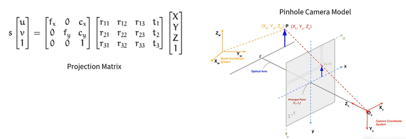
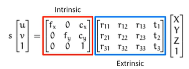

# Camera Model
* 카메라는 3차원 공간인 세상(world)에 존재하는 대상(Object)를 2차원 공간인 이미지 평면(Image Plane)에 투영(Projection)하는 센서
* 카메라 모델은 카메라의 투영 과정을 수학적 모델로 표현한 것

# Pinhole Camera Model

 

# Camera Intrinsic/Extrinsic Calibration
위 매트릭스는 Intrinsic항과 Extrinsic항으로 나뉜다.

- Intrinsic(내부): 카메라의 ***내부적인 특성***(렌즈와 이미지 센서와의 관계로부터 파생되는 초점거리 등...)
- Extrinsic(외부): 카메라가 대상을 촬영했을 당시의 ***위치와 자세***에 관한 특성

 

Extrinsic, Intrinsic으로 구분하는 이유는 무엇일까? 
- Intrinsic: 동일한 위치에서 서로 다른 카메라로 동일한 피사체를 촬영하면, 그 결과가 다른데, 그 이유중 하나로 초점거리를 들 수 있다. 초점거리가 클수록 피사체를 크게 촬영할 수 있다는 사실은 이해하기 쉬울 것이다.
- Extrinsic: 같은 카메라로 서로 다른 위치에서 동일한 피사체를 촬영하면, 그 결과가 다르다.

- Intrinsic Calibration은 초점거리($f_x, f_y$)와 주점($c_y, c_x$)을 위미한다.
- Computer Vision에서는 이미지 센서의 Cell 크기에 대한 상대적인 Pixel단위로 초점거리를 표현한다.
    - 만약 이미지 센서 Cell크기가 $0.1mm$이고, 초점거리 $f = 500(pixel)$이라면
    - 이미지 센서와 렌즈 중심과의 거리는 Cell크기의 $500(pixel)$배 -> $50mm$를 의미한다.

# Intrinsic Matrix
주점, 초점 거리를 모두 포함한 Intrinsic Parameter Matrix는 다음과 같다.

 

$skew_cf_x$는 Image의 비대칭 계수(sker coefficient)를 의미한다. 비대칭 계수는 이미지 센서의 Cell Array의 y축이 기울어진 정도를 의미한다.

# Intrinsic Calibration
3차우너 공간에 존재하는 한 물체가 2차원 이미지 공간에 투영되는 과정을 설명하려면 좌표계가 정의되어야 한다. 
Computer Vision에서는 4개의 좌표계를 사용한다.
1. World Coordinate -> $X_w, Y_w, Z_w$
2. Camera Coordinate -> $X_c, Y_c, Z_c$
3. Image Coordinate -> $u, v$
4. Normalized Image Coordinate -> $u_n, v_n$

## World Coordinate
월드 좌표계는 우리가 살고 있는 3차원 공간에 존재하는 좌표계이다. 
월드 좌표계를 기준으로 물체의 위치나 카메라의 위치를 표현할 수 있다.

## Camera Coordinate
카메라 좌표계는 카메라를 기준으로 표현하는 좌표계이다. 
카메라를 기준으로(일반적으로) 설정하는 좌표계는 다음과 같다.
- 카메라 렌즈가 바라보는 방향 -> $Z_c$
- 카메라 아래쪽 방향 -> $X_C$
- 카메라 오른쪽 방향 -> $Y_C$

## Image Coordinate
이미지 좌표계는 실제 이미지로 표출되는 데이터를 표현하는 좌표계이다. 
이미지 좌표계의 일반적인 기준은 다음과 같다.
- 이미지의 왼쪽 상단을 원점으로 한다.(OpenCV와 동일)
- 이미지의 아래쪽 방향(Column)을 x또는 u로 표현한다.
- 이미지의 아래쪽 방향(Row)를 y또는 v로 표현한다.

## Normalized Coordinate
정규 이미지 좌표계는 실제로 존재하지 않는 좌표계로, Computer Vision에서 해석을 위해 정의한 가상의 좌표계이다. 
렌즈로부터 이미지 평면까지의 거리를 초점거리 라고 정의했는데, 이는 카메라마다 다르기 때문에 이미지 좌표계에서 다른 위치에 존재하게 된다. 
이러한 초점거리에 의한 영향을 제거하고자 사용하는 좌표계

## 정규 좌표계와 이미지 좌표계의 차이
- 이미지 좌표계 -> 카메라 원점으로부터 초점거리만큼 떨어져 있는 이미지 평면
- 정규 이미지 좌표계 -> 카메라 원점으로부터 1만큼 떨어져 있는 가상의 이미지 평면
- 카메라의 Intrinsic Calibration 정보를 알면, 이미지 좌표계 -> 정규 이미지 좌표계로 변환이 가능하다.

 