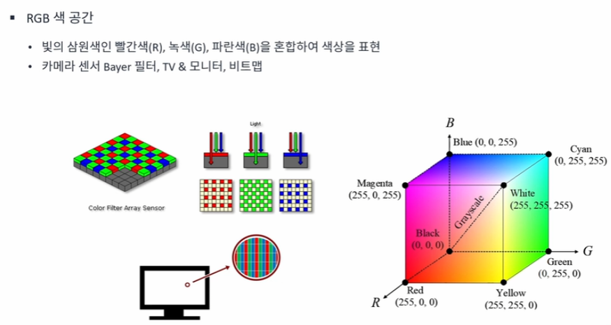
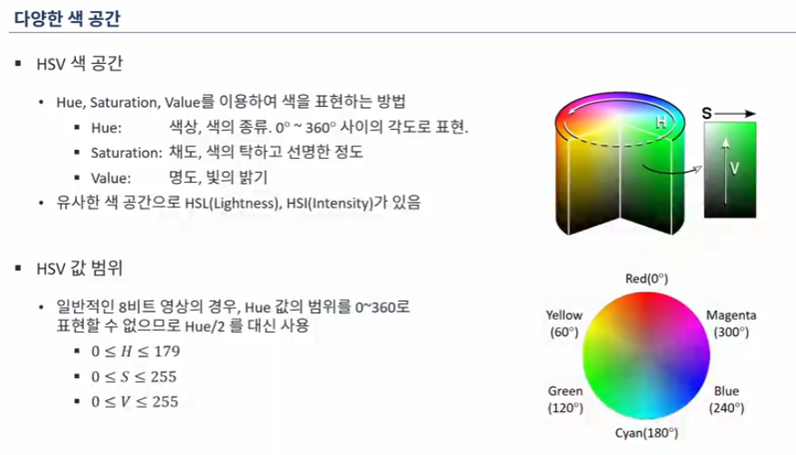
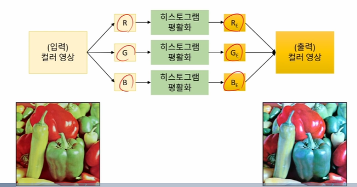

# OpenCV에서 컬러 영상 표현 방법
* BGR색 성분을 각각 256단계로 표현
* CV_8UC3 타입
* OpenCV에서는 RGB순서가 아니라, BGR 순서를 기본으로 사용

# 컬러 영상의 픽셀 값 참조
## 코드 1

```cpp
// Scalar 사용
#include <iostream>
#include "opencv2/opencv.hpp"

using namespace std;
using namespace cv;

int main()
{
	Mat src = imread("lenna.bmp", IMREAD_COLOR);

	if (src.empty()) {
		cerr << "Image laod failed!" << endl;
		return -1;
	}
	Mat dst = Scalar(255, 255, 255) - src;
    
	imshow("src", src);
	imshow("dst", dst);
	waitKey();
}
```

## 결과 화면
{: width="300" height="120"}
<br>

## 코드 2

```cpp
// 픽셀 값 참조
#include <iostream>
#include "opencv2/opencv.hpp"

using namespace std;
using namespace cv;

int main()
{
	Mat src = imread("lenna.bmp", IMREAD_COLOR);

	if (src.empty()) {
		cerr << "Image laod failed!" << endl;
		return -1;
	}
	Mat dst(src.rows, src.cols, CV_8UC3, Scalar(0, 0, 0));
	for (int y = 0; y < src.rows; y++) {
		for (int x = 0; x < src.cols; x++) {
			Vec3b& p1 = src.at<Vec3b>(y, x);
			Vec3b& p2 = dst.at<Vec3b>(y, x);

			p2[2] = 255 - p1[2];
			p2[1] = 255 - p1[1];
			p2[0] = 255 - p1[0];
		}
	}
	imshow("src", src);
	imshow("dst", dst);
	waitKey();
}
```

## 결과 화면
{: width="300" height="120"}
<br>


# 컬러 영상을 그레이 스케일로 변환

$Y = 0.299R + 0.587G + 0.114B$

* 3 : 6 : 1 의 비율
* 장점: 데이터 저장 용량 감소, 연산 처리 속도 향상
* 단점: 색상 정보 손실

# 색 공간 변환

{: width="300" height="120"}
<br>

# 다양한 색 공간

## RGB
{: width="300" height="120"}
<br>

## HSV
{: width="300" height="120"}
<br>

## YCrCb
{: width="300" height="120"}
<br>

# 채널 분리와 병합
## 채널 분리
```cpp
void split(const Mat & src, Mat* mvbegin);
void split(InputArray src, OutputArrayOfArrays mv);
```

## 채널 결합
```cpp
void merge(const Mat* mv, size_t count, OutputArray dst);
void merge(InputArrayOfArrays mv, OutputArray dst);
```

# 컬러 영상의 히스토그램 평활화
{: width="300" height="120"}
<br>

* 밝기 성분에 대해서만 히스토그램 평활화 수행(색상 성분은 그대로 유지)

## 히스토그램 평활화 예제 - YCrCb 색 공간 사용
```cpp
int main(){
    Mat src = imread('peppers.bmp', IMREAD_COLOR);

    Mat src_ycrcb;
    cvtColor(src, src_ycrcb, COLOR_BGR2YCrCb);

    vector<Mat> ycrcb_planes;
    split(src_ycrcb, ycrcb_planes);

    equalizeHist(ycrcb_planes[0], ycrcb_planes[0]);

    Mat dst_ycrcb, dst;
    merge(ycrcb_planes, dst_ycrcb);
    cvtColor(dst_ycrcb, dst, COLOR_YCrCb2BGR);

    imshow("src", src);
    imshow("dst", dst);
    waitKey();
}
```

# 컬러 영상의 색감 바꾸기
* R, G, B 각 색상 채널의 커브를 변경하여 컬러 톤을 변경
* HSV에서 H를 변경

# 컬러 영상에서 특정 색상 추출

## 범위 선택 함수

```cpp
void inRange(InputArray src, UnputArray lowerb, InputArray upperb, OutputArray dst);
```

* lowerb: 하한 값(Mat or Scalar)
* upperb: 상한 값(Mat or Scalar)


# 히스토그램 역투영
{: width="500" height="120"}
<br>

## 히스토그램 역투영 함수
```cpp
void calcBackProject(const Mat* images, int nimages, const int* channels, InputArray hist, OutputArray backProject, const float** ranges, double scale = 1, bool uniform = true);
```

* nimages: 입력 영상 개수
* channels: 영투영 계산에 사용할 채널 목록
* 입력 히스토그램
* backProject: 프로그램 역투영 결과 행렬. 입력 영상과 동일 크기, CV8U
* ranges: 히스토그램 빈 경계값 배열의 배열