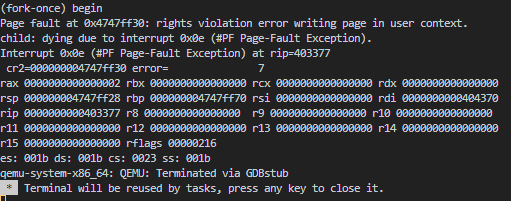
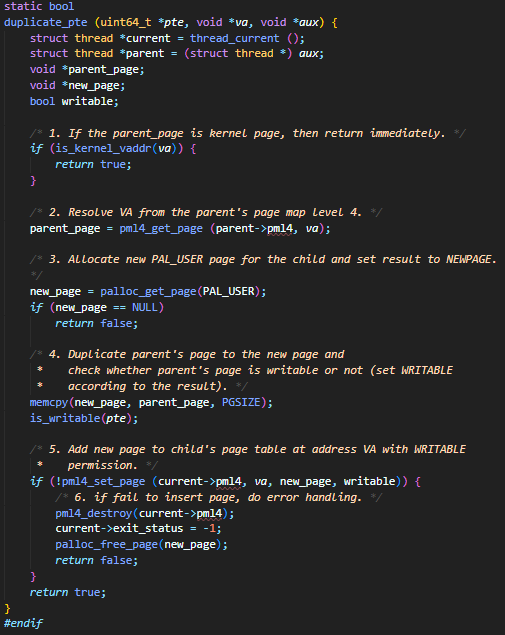
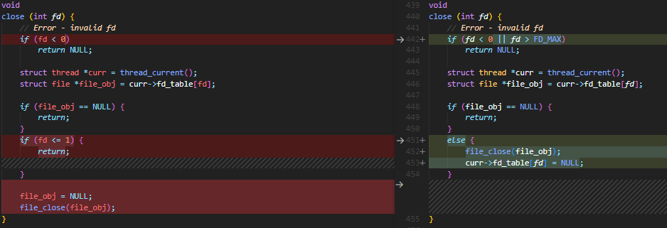

## Pintos project 2 - args parsing, system call

전체 코드는 https://github.com/1stApplePie/pintos-kaist 브랜치를 통해 확인할 수 있다.

### args-parsing

args-parsing은 받은 코드 내에 TODO를 보고 작성을 시작했는데, 이 순서로 진행해서 애로사항이 종종 발생했다.<br>

```c
/* load */
/* TODO: Your code goes here.
	 * TODO: Implement argument passing (see project2/argument_passing.html). */

	 /*
	 High Memory Addresses
	---------------------
	|       argv[n]      | <- (rsp + 8*n)
	|       argv[n-1]    | <- (rsp + 8*(n-1))
	|         ...        |
	|       argv[1]      | <- (rsp + 8)
	|       argv[0]      | <- (rsp)
	|       argc         | <- (rsp - 8)
	|   Return Address   | <- (rsp - 16)
	| Saved Base Pointer | <- (rsp - 24)
	---------------------
	Low Memory Addresses
	 */

	ASSERT(if_->rsp == USER_STACK);
	int argc = 0;
	char *argv[128];

	/*
	rsp
	1. input string array 저장
	2. input string lifo로 stack에 저장 - len: string len
	3. rsp 8배수 정렬
	4. input string addr 저장 + 마지막 NULL까지
	5. return address: (0) 저장 type: void *
	*/

	argc = tokenize_input(file_name, argc, argv);

	for (int i=argc-1; i>=0; i--) {
		if_->rsp -= strlen(argv[i]) + 1;
		// printf("rsp addr: %p\n", if_->rsp);
		strlcpy(if_->rsp, argv[i], strlen(argv[i])+1);
		// printf("saved string: %s\n", if_->rsp);
		argv[i] = if_->rsp;
	}

	round_stack_pt(if_);

	// argv[argc] = NULL;
	for (int i = argc; i >= 0; i--) {
		if_->rsp -= sizeof(char *);
		// printf("rsp addr: %p\n", if_->rsp);
		if (i == argc) {
			continue;
		}
		memcpy(if_->rsp, &(argv[i]), sizeof(char *));
		// printf("saved str ptr: %p\n", (void *)(*((void **)(if_->rsp))));
	}

	if_->R.rsi = if_->rsp;
	if_->R.rdi = argc;

	void *null_ptr = NULL;
	if_->rsp -= sizeof(void *);
	// printf("rsp addr: %p\n", if_->rsp);
	success = true;

done:
	/* We arrive here whether the load is successful or not. */
	// 닫히면서 write deny가 풀림
	// file_close (file);
	return success;
}
```

### 문제 1

program name이 parsing이 제대로 되지 않는다.<br>

```c
/* process.c - load */
/* Open executable file. */
	char *fn_copy;
	fn_copy = palloc_get_page (0);
	if (fn_copy == NULL)
		return TID_ERROR;
	strlcpy (fn_copy, file_name, PGSIZE);

	char *arg_ptr;

	file = filesys_open (strtok_r(fn_copy, " ", &arg_ptr));
```
<br>
프로그램 이름을 파싱하는 부분을 tokenize하여 대입할 수 있도록 변경

### 문제 2

thread name이 parsing이 제대로 되지 않는다.<br>

```c
/* process.c process_create_initd
char *n_copy[strlen(file_name)+1];
	char *n_ptr;
	strlcpy (n_copy, file_name, PGSIZE);

	/* Create a new thread to execute FILE_NAME. */
	exec_tid = thread_create (strtok_r(n_copy, " ", &n_ptr), PRI_DEFAULT, initd, fn_copy);
	if (exec_tid == TID_ERROR)
		palloc_free_page (fn_copy);
```

위와 같이 변경하면 thread name parsing이 제대로 이루어진다.

### system call
1. halt
    크게 어렵지 않게 1줄로 끝나는 시스템 콜이었다.
    ```c
    void halt(void) {
	power_off();
    }
    ```

2. exit

    exit status를 thread에 반환하고, exit status가 얼마인지 print하는 함수가 필요했던 system call
    ```c
    void
    exit (int status) {
        struct thread *curr = thread_current();
        curr->exit_status = status;
        printf("%s: exit(%d)\n", thread_name(), status);
        thread_exit();
    }
    ```

3. fork

    fork system call 자체는 매우 쉽게 완성하였으나, process_fork 구현에 가장 많은 시간을 쏟았다.<br>

    ```c
    pid_t
    fork (const char *thread_name, struct intr_frame *f){
        return (pid_t)process_fork(thread_name, f);
    }

    tid_t
    process_fork (const char *name, struct intr_frame *if_) {
        /* Clone current thread to new thread.*/
        /*
        부모 스레드는 현재 실행중인 유저 스레드
        현재 시스템콜로 인해 tf.rsp는 kernel stack
        따라서 입력받은 if_를 복제
        */
        struct thread *curr = thread_current();

        tid_t child_tid = thread_create (name,
                PRI_DEFAULT, __do_fork, if_);

        if (child_tid == TID_ERROR) {
            return TID_ERROR;
        }

        struct thread *child = find_child_process(child_tid);

        sema_down(&child->fork_sema);

        return child_tid;
    }

    static bool
    duplicate_pte (uint64_t *pte, void *va, void *aux) {
        struct thread *current = thread_current ();
        struct thread *parent = (struct thread *) aux;
        void *parent_page;
        void *new_page;
        bool writable;

        /* 1. If the parent_page is kernel page, then return immediately. */
        if (is_kernel_vaddr(va)) {
            return true;
        }

        /* 2. Resolve VA from the parent's page map level 4. */
        parent_page = pml4_get_page (parent->pml4, va);

        /* 3. Allocate new PAL_USER page for the child and set result to NEWPAGE.
        */
        new_page = palloc_get_page(PAL_USER);
        if (new_page == NULL)
            return false;

        /* 4. Duplicate parent's page to the new page and
        *    check whether parent's page is writable or not (set WRITABLE
        *    according to the result). */
        memcpy(new_page, parent_page, PGSIZE);
        writable = is_writable(pte);

        /* 5. Add new page to child's page table at address VA with WRITABLE
        *    permission. */
        if (!pml4_set_page (current->pml4, va, new_page, writable)) {
            /* 6. if fail to insert page, do error handling. */
            pml4_destroy(current->pml4);
            current->exit_status = -1;
            palloc_free_page(new_page);
            return false;
        }
        return true;
    }

    static void
    __do_fork (void *aux) {
        struct intr_frame if_;
        struct thread *current = thread_current ();
        struct thread *parent = current->parent_process;
        /* somehow pass the parent_if. (i.e. process_fork()'s if_) */
        struct intr_frame *parent_if = (struct intr_frame *)aux;

        bool succ = true;

        /* 1. Read the cpu context to local stack. */
        memcpy (&if_, parent_if, sizeof (struct intr_frame));
        current->tf = if_;

        /* 2. Duplicate PT */
        current->pml4 = pml4_create();
        if (current->pml4 == NULL)
            goto error;

        process_activate (current);
    #ifdef VM
        supplemental_page_table_init (&current->spt);
        if (!supplemental_page_table_copy (&current->spt, &parent->spt))
            goto error;
    #else
        if (!pml4_for_each (parent->pml4, duplicate_pte, parent))
            goto error;
    #endif

        /* TODO: Your code goes here.
        * TODO: Hint) To duplicate the file object, use `file_duplicate`
        * TODO:       in include/filesys/file.h. Note that parent should not return
        * TODO:       from the fork() until this function successfully duplicates
        * TODO:       the resources of parent.*/
        process_init ();

        for (int i = 2; i<parent->fd_idx; i++) {
            if (parent->fd_table[i] != NULL) {
                current->fd_table[i] = file_duplicate(parent->fd_table[i]);
            }
            else {
                current->fd_table[i] = NULL;
            }
        }
        current->fd_idx = parent->fd_idx;

        sema_up(&current->fork_sema);

        // In child process, the return value should be 0
        current->tf.R.rax = 0;	

        /* Finally, switch to the newly created process. */
        if (succ) {
            do_iret (&current->tf);
        }
            
    error:
        succ = false;
        sema_up(&current->fork_sema);
        current->exit_status = -1;
        // thread_exit ();
        exit(-1);
    }
    ```

4. exec

    cmd_line을 인자로 받아 process_exec을 실행하는데, 해당 함수 내에서 palloc_free를 호출해 cmd_line을 palloc을 통해 복사하는 과정이 필요했다.

    ```c
    int
    exec (const char *cmd_line) {
        if (cmd_line == NULL) {
            thread_current()->exit_status = -1;
            thread_exit();
        }

        void *cmd_copy;
        cmd_copy = palloc_get_page(PAL_ZERO);
        if (cmd_copy == NULL)
            return -1;
        
        strlcpy(cmd_copy, cmd_line, PGSIZE);

        return process_exec(cmd_copy);
    }

    int
    process_exec (void *f_name) {
        char *file_name = f_name;
        bool success;

        /* We cannot use the intr_frame in the thread structure.
        * This is because when current thread rescheduled,
        * it stores the execution information to the member. 
        */
        struct intr_frame _if;
        // ds: 0x2c, es: 0x28, ss: 0x48, SEL_UDSEG: User Data Segment
        _if.ds = _if.es = _if.ss = SEL_UDSEG;
        _if.cs = SEL_UCSEG;	// cs: 0x3c, SEL_UCSEG: User Code Segment
        // eflags: 0x40
        // FLAG_IF: Interrupt Enable Flag, 해당 비트가 1로 설정되어 있으면 인터럽트가 활성화된 상태
        // FLAG_MBS: Memory Barrier Shadow, 메모리 배리어 동작을 지시하는 데 사용
        _if.eflags = FLAG_IF | FLAG_MBS; // 인터럽트를 활성화하고, 메모리 베리어 동작을 활성화

        /* We first kill the current context */
        process_cleanup ();

        /* And then load the binary */
        success = load (file_name, &_if);

        sema_up(&(thread_current()->load_sema));

        /* If load failed, quit. */
        if (!success)
        {
            palloc_free_page (file_name);
            return -1;
        }
        /* Start switched process. */
        do_iret (&_if);	// if에 arg에 관한 정보를 담았으므로, 해당 정보를 cpu에 올리는 작업
        NOT_REACHED ();
    }
    ```

5. wait

    process_wait 함수를 호출하는 것으로 끝나는 system call<br>
    하지만, 처음 무한루프로 구현했던 process_wait에서 다음 단계로 넘어갈 때 무한루프->busy_waiting->wait semaphore <br>
    크게 3가지 단계를 거쳐 구현한 만큼 많은 고민이 필요했던 부분이다.

    ```c
    int
    wait (pid_t pid) {
        return process_wait(pid);
    }

    int
    process_wait (tid_t child_tid UNUSED) {
        /* XXX: Hint) The pintos exit if process_wait (initd), we recommend you
        * XXX:       to add infinite loop here before
        * XXX:       implementing the process_wait. */
        struct thread *parent_process = thread_current();
        struct thread *child_process = find_child_process(child_tid);;
        if (child_process == NULL) {
            return -1;
        }

        sema_down(&child_process->wait_sema);
        int exit_status = &child_process->exit_status;
        list_remove(&child_process->child_elem);
        sema_up(&child_process->free_sema);
        
        return child_process->exit_status;
    }
    ```

6. create

    file name으로 fd를 어떻게 생성해서 return 해주느냐를 고민하게 했던 부분인데, 생각보다 간단하게 file system 쪽에서 filesys_create라는 함수가 구현되있어서 편하게 진행했던 부분이다.

    ```c
    bool
    create (const char *file, unsigned initial_size) {
        if (file == NULL || initial_size<0) {
            exit(-1);
        }
        return filesys_create(file, initial_size);
    }
    ```

7. remove

    create와 마찬가지로 이미 구현된 함수를 사용해서 편하게 구현했던 부분

    ```c
    bool
    remove (const char *file) {
        return filesys_remove(file);
    }
    ```

8. open

    테스트 케이스가 1개(oom)이 남기 전까지는 filesys_open을 통해 간단하게 구현했던 부분<br>
    하지만, 마지막 테스트 케이스까지 통과하려면, 많은 부분을 고려하여 이 부분을 수정해야 한다.<br>

    ```c
    int
    open (const char *file) {
        if (file == NULL) {
            return -1;
        }

        struct file* opened_f = filesys_open(file);
        if (opened_f == NULL) {
            return -1;
        }

        struct thread *curr = thread_current();

        if (curr->fd_idx > FD_MAX) {
            file_close(opened_f);
            return -1;
        }

        curr->fd_table[curr->fd_idx++] = opened_f;

        return curr->fd_idx-1;
    }
    ```

9. filesize

    filesize에 대한 테스크 케이스가 없어 구현 우선순위에서 미뤄두었다가, read, write 테스트 케이스에서 옳바른 size로 읽어오지 않아 고민해보던 중 'filesize를 구하지 않고 read, write 입력인자로 size를 받을 수 있나?'라는 고민 후에 구현해서 read, write 테스트 케이스를 통과할 수 있었다.
    ```c
    int
    filesize (int fd) {
        struct thread *curr = thread_current();
        struct file* opened_f = curr->fd_table[fd];

        if (opened_f == NULL) {
            return -1;
        }

        return file_length(opened_f);
    }
    ```

10. read

    create, remove와 마찬가지로, fd를 통해 어떻게 파일에 접근해서 데이터를 얻어오는가?에 대한 질문이 먼저 생각났던 부분<br>
    이 부분 또한 file.h에서 구현된 함수를 사용하는 것으로 구현이 마무리 되었다.

    ```c
    int
    read (int fd, void *buffer, unsigned size) {
        if (fd < 0 || fd == 1)
            return -1;
            
        struct thread *curr = thread_current();
        struct file* opened_f = curr->fd_table[fd];

        sema_down(&mutex);
        
        if (opened_f == NULL) {
            sema_up(&mutex);
            return -1;
        }
        
        // fd 0 reads from the keyboard using input_getc()
        else if (fd == 0) {
            char *buf_pos = (char *)buffer;
            while ((buf_pos - (char *)buffer) < size - 1) {
                *buf_pos = input_getc();
                if (*buf_pos == '\0' || *buf_pos == '\n') {
                    break;
                }
                buf_pos += 1;
            }
            *buf_pos = '\0';
            sema_up(&mutex);
            return buf_pos - (char *)buffer;
        }

        else if (fd >= 2) {
            off_t res = file_read(opened_f, buffer, size);
            sema_up(&mutex);
            return res;
        }

        sema_up(&mutex);
        return -1;
    }
    ```

11. write

    read와 같은 고민을 했고, test case들을 시작할 때, 디버깅을 해보면 system call(rax) 이 10번으로 들어오는 것을 확인할 수 있다.<br>
    즉, fd가 1(STD OUTPUT)을 먼저 처리해야 테스트를 시작할 수 있는 것. 이번 프로젝트에서 구현 순서가 가장 앞에 있는 system call이다.

    ```c
    int
    write (int fd, const void *buffer, unsigned size) {
        if (fd <= 0)
            return NULL;
        
        sema_down(&mutex);

        if (fd == STD_OUTPUT) {
            putbuf(buffer, size);
            sema_up(&mutex);
            return size;
        }

        else {
            struct thread *curr = thread_current();
            struct file* opened_f = curr->fd_table[fd];

            if (opened_f == NULL) {
                sema_up(&mutex);
                return 0;
            }
            off_t res = file_write(opened_f, buffer, size);
            sema_up(&mutex);
            return res;
        }

        sema_up(&mutex);
        return 0;
    }
    ```

12. seek, tell

    file.h에 구현된 함수를 사용하는 것 만으로 구현이 완료된 system call

    ```c
    /*
	Changes the next byte to be read or written in open file fd to position, 
	expressed in bytes from the beginning of the file (Thus, a position of 0 is the file's start).
	A seek past the current end of a file is not an error. 
	A later read obtains 0 bytes, indicating end of file. 
	A later write extends the file, filling any unwritten gap with zeros.
	(However, in Pintos files have a fixed length until project 4 is complete, 
	so writes past end of file will return an error.) 
	These semantics are implemented in the file system and
	do not require any special effort in system call implementation.
    */
    void
    seek (int fd, unsigned position) {
        struct thread *curr = thread_current();
        struct file *opened_f = curr->fd_table[fd];

        file_seek(opened_f, position);
    }


    /*
        Returns the position of the next byte to be read or written in open file fd, 
        expressed in bytes from the beginning of the file.
    */
    unsigned
    tell (int fd) {
        struct thread *curr = thread_current();
        struct file *opened_f = curr->fd_table[fd];

        return file_tell(opened_f);
    }
    ```

13. close

    open과 마찬가지로, 마지막 oom test case전까지는 간단하게 구현해서 진행했으나, oom test case에서 이 부분을 수정해야 통과가 가능했다.<br>

    ```c
    void
    close (int fd) {
        // Error - invalid fd
        if (fd < 0 || fd > FD_MAX)
            return NULL;

        struct thread *curr = thread_current();
        struct file *file_obj = curr->fd_table[fd];

        if (file_obj == NULL) {
            return;
        }
        else {
            file_close(file_obj);
            curr->fd_table[fd] = NULL;
        }
    }
    ```

## ISSUE

### ISSUE 1

user context write 권한이 없어 문제 발생






result: writable 변수에 값을 할당하지 않은 채로 함수에 인자로 넣어줬는데 에러가 아닌 fail 발생

### ISSUE 2


child 4가 O로 생성이 되어야 하는데 PF로 인해 생성되지 않고 멈춰버리는 상황 발생


FD_MAX값에 제한을 두지 않고 진행하여 fd_idx값이 500이상으로 커지면서 pg size를 넘어설 때 발생하는 오류
FD_MAX를 설정하고 예외처리를 해주면서 진행하여 해결

### ISSUE 3


메모리 leak, 추가적인 문제


