Morphological Transformation은 이미지 모양을 기반으로 하는 몇 가지 간단한 작업이다. 일반적으로 binary image에서 실행되고, 입력으로 원본 이미지와 구조 요소(또는 커널)을 필요로 한다.<br>
두 개의 기본 Morphological 연산자는 Erosion과 Dilation이 있다.
<br>
<hr>

# Erosion
Erosion은 커널이 이미지를 통과하며 이동한다. 이는 CNN에서 2D conv filter를 사용하는 것과 유사하다. 원본 이미지의 픽셀은 커널 아래의 모든 픽셀이 1인 경우에만 1로 간주되고 이외는 0으로 간주한다.<br>
따라서 Erosion에서는 커널의 크기 조절로 노이즈 제거나 두께 크기 조정이 가능하다.<br>

다음의 이미지를 처리 해보면서 확인하자.


<br>

## Erosion - 커널 크기를 변경해보기

## 코드
```py
import cv2 as cv
import numpy as np
import matplotlib.pyplot as plt

img = cv.imread('practice.jpg', cv.IMREAD_GRAYSCALE)
assert img is not None, "file could not read, check with os.path.exists()"

kernel = np.ones((5, 5), np.uint8)
erosion = cv.erode(img, kernel, iterations = 1)

plt.imshow(erosion)
plt.show()
```

## 실행 화면

### kernel = 5, 5

<br>

### kernel = 10, 10
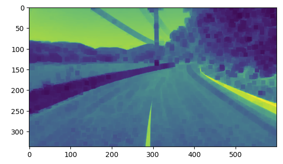
<br>

### kernel = 20, 20

<br>

커널 크기가 증가할수록 더 많은 노이즈가 제거되는 것을 볼 수 있다.
<hr>

# Dilation
위의 Erosion과 반대 개념으로, 커널 내의 적어도 하나의 픽셀이 1이면, 픽셀 요소가 1로 변경되는 연산자.<br>
커널의 크기에 따라 흰색 영역이 커지거나, 객채의 크기가 증가.<br>
Erosion에서는 노이즈와 함께 객체도 줄어들었으나, Dilation은 노이즈 제거와 객체 확장이 함께 발생

## Dilation - 커널 크기를 변경해보기

## 코드
```py
import cv2 as cv
import numpy as np
import matplotlib.pyplot as plt

img = cv.imread('practice.jpg', cv.IMREAD_GRAYSCALE)
assert img is not None, "file could not read, check with os.path.exists()"

kernel = np.ones((5, 5), np.uint8)
dilation = cv.dilate(img, kernel, iterations = 1)

plt.imshow(dilation)
plt.show()
```

### kernel = 5, 5

<br>

### kernel = 10, 10
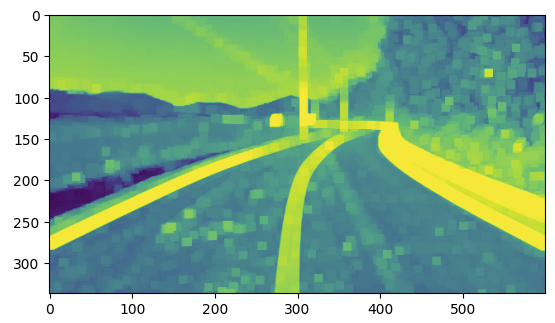
<br>

### kernel = 20, 20
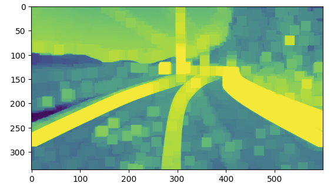
<br>

원하는 차선 영역 확대는 이루어졌으나 화이트 노이즈 또한 확대되었다.
<hr>

# Opening
화이트 노이즈는 없애면서 차선은 확대하는 법은 없을까?<br>
이는 Opening을 통해 확인해보자. Opening은 erosion 후에 dilation 작업이 이루어진다.

## Opening - 커널 크기를 변경해보기

## 코드
```py
import cv2 as cv
import numpy as np
import matplotlib.pyplot as plt

img = cv.imread('practice.jpg', cv.IMREAD_GRAYSCALE)
assert img is not None, "file could not read, check with os.path.exists()"

kernel = np.ones((5, 5), np.uint8)
opening = cv.morphologyEx(img, cv.MORPH_OPEN, kernel)

plt.imshow(opening)
plt.show()
```

### kernel = 5, 5

<br>

### kernel = 10, 10

<br>

### kernel = 20, 20
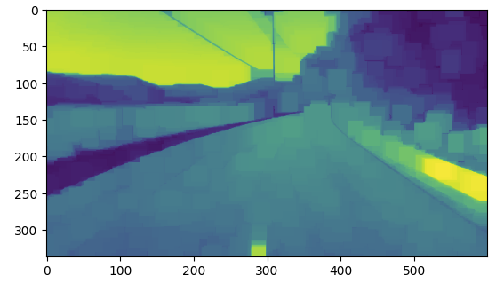
<br>

erosion보다는 선명한 차선과 dilation보다는 적은 화이트 노이즈를 확인할 수 있었다.
<hr>

# Closing
Opening과는 반대되는 개념으로 dilation 후에 erosion이 이루어진다.

## 코드
```py
import cv2 as cv
import numpy as np
import matplotlib.pyplot as plt

img = cv.imread('practice.jpg', cv.IMREAD_GRAYSCALE)
assert img is not None, "file could not read, check with os.path.exists()"

kernel = np.ones((5, 5), np.uint8)
closing = cv.morphologyEx(img, cv.MORPH_CLOSE, kernel)

plt.imshow(closing)
plt.show()
```

### kernel = 5, 5
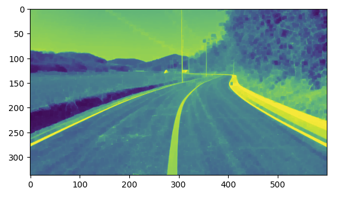
<br>

### kernel = 10, 10

<br>

### kernel = 20, 20
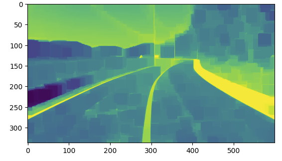
<br>

Opening에 비해 화이트 노이즈 제거 효과는 약하지만 차선을 부각시키는데는 가장 효과적이었다.
<hr>

# Morphological Gradient
객체의 윤곽선 검출에 사용하는 연산자

## 코드
```py
import cv2 as cv
import numpy as np
import matplotlib.pyplot as plt

img = cv.imread('practice.jpg', cv.IMREAD_GRAYSCALE)
assert img is not None, "file could not read, check with os.path.exists()"

kernel = np.ones((5, 5), np.uint8)
gradient = cv.morphologyEx(img, cv.MORPH_GRADIENT, kernel)

plt.imshow(gradient)
plt.show()
```

### kernel = 5, 5
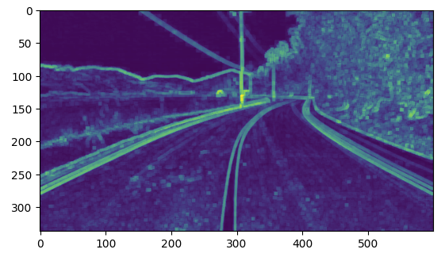
<br>

### kernel = 10, 10
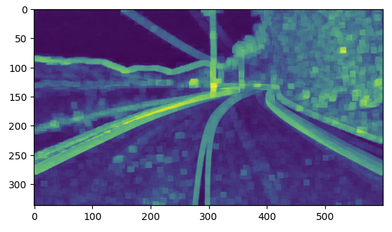
<br>

### kernel = 20, 20
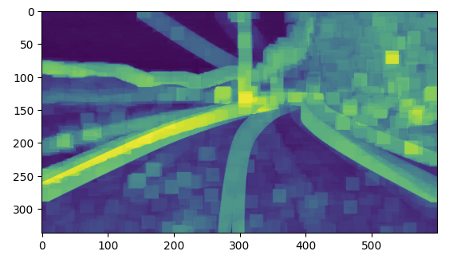
<br>

binary 이미지에서 contour 필터를 사용한 윤곽선 검출은 많이 진행해보았으나 이 방법도 좋은것같다.
<hr>

# Top Hat
밝기 값이 크게 변화하는 영역 강조

## 코드
```py
import cv2 as cv
import numpy as np
import matplotlib.pyplot as plt

img = cv.imread('practice.jpg', cv.IMREAD_GRAYSCALE)
assert img is not None, "file could not read, check with os.path.exists()"

kernel = np.ones((5, 5), np.uint8)
tophat = cv.morphologyEx(img, cv.MORPH_TOPHAT, kernel)

plt.imshow(tophat)
plt.show()
```

### kernel = 5, 5
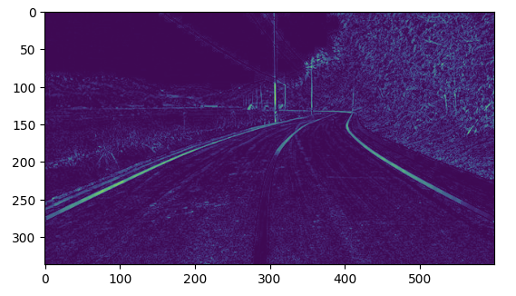
<br>

### kernel = 10, 10

<br>

### kernel = 20, 20
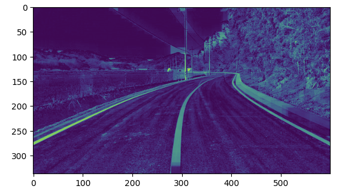
<br>
<hr>

# Black Hat
어두운 부분을 강조

## 코드
```py
import cv2 as cv
import numpy as np
import matplotlib.pyplot as plt

img = cv.imread('practice.jpg', cv.IMREAD_GRAYSCALE)
assert img is not None, "file could not read, check with os.path.exists()"

kernel = np.ones((5, 5), np.uint8)
tophat = cv.morphologyEx(img, cv.MORPH_TOPHAT, kernel)

plt.imshow(tophat)
plt.show()
```

### kernel = 5, 5

<br>

### kernel = 10, 10
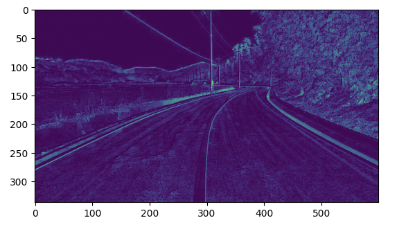
<br>

### kernel = 20, 20

<br>

# Reference
https://docs.opencv.org/4.x/d9/d61/tutorial_py_morphological_ops.html